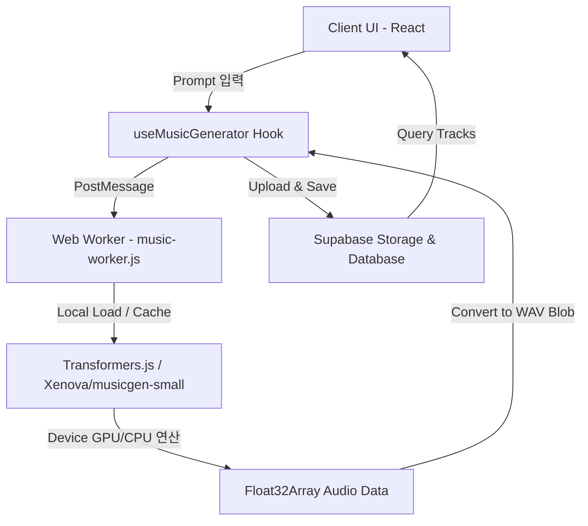

# 🎵 mu8ic (뮤직) — Client-Side AI Music Generator

> **브라우저 로컬 AI 연산을 활용하여 서버 비용 없이 동작하는 YouTube 영상용 royalty-free 음악 생성 플랫폼**

<p align="center">
  
  
  
  
  
</p>

---

## 🚀 프로젝트 개요

**mu8ic**은 외부 API의 비용적·인프라적 제약 조건(API 요금제 장벽, 트래픽 한계)을 극복하기 위해 설계된 **엣지 AI(Edge AI) 기반 음악 생성 서비스**입니다. 

기존의 단순 서버 사이드 AI API 호출(API Wrapper) 방식에서 탈피하여, **사용자의 브라우저 자원(WASM/WebGPU)을 활용해 클라이언트 사이드에서 직접 음악을 모델링 및 생성**하는 하이브리드 아키텍처를 채택하고 있습니다. 이를 통해 **서버 비용 0원**으로 무제한 구동 가능한 지속 가능한 웹 서비스를 실현했습니다.

---

## 🛠 아키텍처 및 시스템 흐름도



---

## ✨ 핵심 기술적 문제 해결 (Core Engineering Challenges)

### 1. 외부 API 의존성 탈피: Edge AI (Transformers.js) 도입
* **문제 상황**: Replicate, Hugging Face 등의 외부 서버리스 AI API를 연동했으나, 빈번한 서비스 장애(503 Service Unavailable), 유료화 장벽, 그리고 과다한 API 사용료 문제로 상용 서비스 배포 단계에서 인프라 유지 비용 리스크 발생.
* **해결 방안**: 브라우저 환경에서 기계 학습 모델을 직접 추론할 수 있는 `Transformers.js`를 전격 도입. **서버 연산 부담을 완전히 제거(Zero-Server-Cost)**하여 무제한 음악 생성이 가능한 환경 구축.
* **최적화**: 외부 CDN 스크립트 로드 시 발생하는 CSP(콘텐츠 보안 정책) 및 네트워크 불안정성을 방지하기 위해 라이브러리(`transformers.min.js`)를 **로컬 정적 자원(`public/`)으로 내재화**. 브라우저 캐싱을 활성화하여 최초 1회(약 300MB) 모델 다운로드 후에는 네트워크 통신 없이 즉각 연산하도록 최적화.

### 2. 멀티스레딩(Web Worker)을 활용한 UI 반응성(60fps) 보장
* **문제 상황**: AI 모델 로드 및 오디오 텐서 연산은 고부하 작업으로, 단일 스레드 구조인 자바스크립트 환경에서 실행 시 모델 구동 중에 메인 브라우저 화면이 굳어버리는 UI Blocking(Frame Drop) 현상 발생.
* **해결 방안**: **Web Worker**를 적용해 AI 추론 프로세스를 메인 렌더링 스레드와 완전 격리된 백그라운드 스레드로 이전.
* **효과**: AI 모델 다운로드 비율 및 생성 상태를 실시간 메시징(`postMessage`)으로 UI에 수신받아 부드러운 진행률(Progress Bar) 표시를 제공하는 한편, 메인 스레드는 **60fps의 렌더링 성능을 일관되게 유지**.

### 3. 클라이언트 사이드 오디오 파일 인코딩
* **문제 상황**: `Transformers.js` 모델(`musicgen-small`)의 추론 결과물은 가공되지 않은 raw float 데이터(`Float32Array`)로 반환되므로, 브라우저 오디오 태그나 파일 다운로드 기능에서 즉시 재생이 불가.
* **해결 방안**: Web Audio API 규격을 준수하는 **커스텀 WAV 파일 인코더(`encodeWAV`)**를 클라이언트 단에 작성. 샘플 데이터의 바이트 배열 매핑 및 헤더 정보(RIFF, WAVE, fmt, data 청크)를 동적으로 생성하여 실시간으로 다운로드 가능한 오디오 Blob 객체 생성 및 재생 최적화 성공.

### 4. Next.js App Router + Supabase SSR 인증 및 데이터 연동
* **문제 상황**: 서버 사이드 렌더링(SSR) 및 App Router 환경에서 Google OAuth 로그인 이후 클라이언트와 서버 간 세션 상태가 불일치하는 로그인 끊김 현상 발생.
* **해결 방안**: `@supabase/ssr` 모듈의 `createBrowserClient`를 세팅하고 인증 방식을 **PKCE Flow(Cookie 기반 세션 공유)**로 개선. 미들웨어를 구축하여 라우팅 보호 및 유저 권한 확인을 공고히 처리.

---

## 🔍 실무적 트러블슈팅 및 디버깅 기록 (Troubleshooting)

개발 과정에서 겪은 수많은 에러와 해결 과정은 [상세 개발 로그 문서 (dev-log.md)](./docs/dev-log.md)에 실시간으로 기록하며 진행했습니다. 이 중 프로젝트의 완성도를 높인 주요 디버깅 사례는 다음과 같습니다.

### 1. 외부 API 보안 키 노출 대응 및 Git 히스토리 관리 (Git Push Protection)
* **상황**: 로컬 테스트 스크립트 작성 중 Supabase Service Role Key가 하드코딩된 상태로 커밋되어 GitHub Push Protection에 의해 푸시가 차단됨.
* **해결**: 노출된 키를 즉시 Supabase 대시보드에서 재발급(Rotate)하고, `.env.local`을 통해 환경 변수로 관리하도록 코드를 수정했습니다. 또한, 커밋 히스토리에 남아있는 보안 기록을 영구 제거하기 위해 `git commit --amend` 작업을 수행하여 보안 사고에 예방 조치를 취했습니다.

### 2. SSR 환경에서의 React Server Component (RSC) 프로프 직렬화 오류
* **상황**: Lucide 아이콘 컴포넌트(함수 객체)를 Server Component에서 Client Component의 Props로 직접 넘기려 할 때 `Only plain objects can be passed...` 런타임 에러 발생.
* **해결**: Server Component와 Client Component 간 경계에서 직렬화(Serialization) 불가능한 데이터를 전송할 수 없음을 파악하고, 호출 컴포넌트 최상단에 `'use client'` 지시어를 명시하여 클라이언트 런타임 영역 내에서 안전하게 객체가 전달되도록 수정했습니다.

### 3. Lucide-React 메이저 버전에 따른 아이콘 Deprecation 에러
* **상황**: 최신 `lucide-react` 라이브러리 빌드 시 SNS 브랜드 아이콘(`Instagram`, `Twitter` 등)이 존재하지 않아 빌드 실패.
* **해결**: 라이브러리 업데이트 노트를 파악하여 메이저 버전 변화 과정에서 브랜드 관련 아이콘이 제거되었음을 확인. 이를 시스템에서 항상 보장하는 범용 아이콘(`Music`, `Globe` 등)으로 대체하고 안전하게 렌더링되도록 타입을 직접 선언하여 유연성을 높였습니다.

---

## 🎨 화면 설계 및 UX 디자인

* **다크 모드 & Liquid Glass 디자인**: 전문가 수준의 오디오 워크스테이션(DAW) 룩앤필을 지향하여 `#171717` 계열의 다크 테마와 Glassmorphism UI 설계.
* **웨이브폼 비주얼라이저**: 생성된 오디오 트랙을 가독성 높게 표시하고 즉각적인 조작이 가능한 미니멀 재생기 디자인.
* **부드러운 마이크로 인터랙션**: `framer-motion`을 사용하여 모달 팝오버, 프롬프트 입력창 포커싱, 툴바 등의 요소에 사용자 몰입감을 증대시키는 인터랙션 가미.

---

## 🛠 Tech Stack

| 분류 | 기술 기술 / 라이브러리 |
| --- | --- |
| **Framework** | Next.js (App Router, v15+), React (v19) |
| **Language** | TypeScript |
| **AI / Inference** | Transformers.js (v2.x), Web Worker, WASM/WebGPU |
| **Backend / DB** | Supabase (Database, Storage, Auth Callback) |
| **Styling / UI** | TailwindCSS, Framer Motion, Radix UI (Tooltip, Dialog) |

---

## 🏃‍♂️ 실행 방법 (Getting Started)

### 1. 환경 변수 구성
프로젝트 루트 폴더에 `.env.local` 파일을 생성하고 아래 변수들을 구성합니다.

```env
NEXT_PUBLIC_SUPABASE_URL=YOUR_SUPABASE_URL
NEXT_PUBLIC_SUPABASE_ANON_KEY=YOUR_SUPABASE_ANON_KEY
```

### 2. 패키지 설치 및 실행
```bash
# 의존성 패키지 설치
npm install

# 로컬 개발 서버 실행
npm run dev
```

---

## 📝 핵심 교훈 및 회고 (Key Takeaways)

1. **상용 인프라 운영의 지속 가능성**: AI 서비스를 설계할 때 단순히 상용 API를 갖다 쓰는 것을 넘어, 서버 유지 비용과 사용자 경험 간의 균형을 극복하기 위한 아키텍처 고민의 중요성을 깨달았습니다.
2. **싱글 스레드 환경의 한계 극복**: 클라이언트 환경에서 고부하 머신러닝 연산을 구동할 때 멀티스레딩(Web Worker) 처리가 웹 앱의 UX 가용성을 어떻게 끌어올리는지 직접 검증하였습니다.
3. **엄격한 보안 정책 대응**: Supabase OAuth 연동과 로컬 스크립트 서빙을 거치며 최신 브라우저의 쿠키/세션 보안 모델 및 CSP에 대한 폭넓은 이해도를 기르게 되었습니다.
